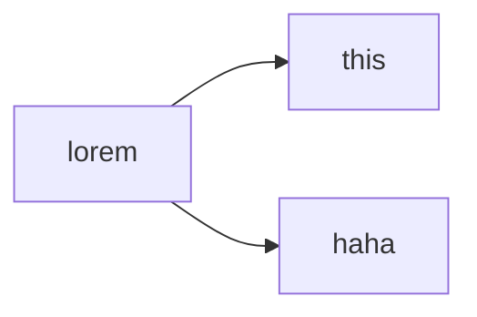

# This is the primary header
My parser allows *"bad practice"* which is the lines are right next to each other. 
When you go to a new line, it automatically inserts a br element, which I would draw, but I don't have any kind of escaping enabled. 

Here's an example of a _blockquote_. Note that you can insert __anything__ into it. 

> ### Start of quote
> 
> This is the new thing. 
> Hmm.. do code blocks work in here? 
> ```txt
> this is a txt file
> ```

And I suppose I could test nested blockquote though I think they look ugly and can think of no practical use for them.. 

> ## Start of block
> > Internal quote
---
There should be a horizontal line above here. 

Let's see, what else ~have I implemented~ have I done... `Code blocks`! 
```csharp
/// <summary>
/// Class <c>Rotation</c> stores a single RotationAngle as a double (rounded to 2 decimal places)
/// and provides a number of helpful methods and properties to work with 2D angles. It
/// calculates the unit circle point on creation for quick retrieval.
/// </summary>
public readonly struct Rotation2D : IEquatable<Rotation2D>, IComparable<Rotation2D> {
    private readonly double rotationAngle;
    private readonly double xCoord;
    private readonly double yCoord;


}
```

You can also do **Latex**, both inline $\text{like this} \sum_0^i{x^2 + 3}$ and in a code block: 
```math
\sum_0^i{x^2 + 3}
```

I support Mermaid diagrams, so...



Here's a [link to the Org github](https://github.com/HowlDevOrg). You can also put a space and add in a title [for the hover effect](https://github.com/HowlDevOrg for the hover effect). 

---

Some of the harder parts I need to worry about: 

- Simple ul
- Part 2
1. Simple ol
2. part 2

- Nested ul
  - This is inside
    1. This is further inside
- And *this is the outside*

1. Nested ol
  1. this is inside
  1. This is also inside
1. These numbers are funny

- Nested ul
  1. This is inside
- And this is the **outside**

1. Nested _ol_
  - this is __inside__
1. These numbers are funny