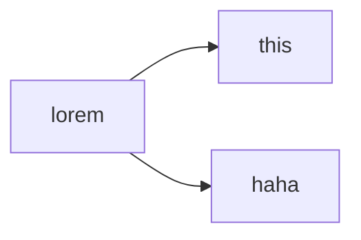

# This is the primary header
My parser allows *"bad practice"* which is the lines are right next to each other. 
When you go to a new line, it automatically inserts a br element, which I would draw, but I don't have any kind of escaping enabled. 

Here's an example of a _blockquote_. Note that you can insert __anything__ into it. 

> ### Start of quote
> 
> This is the new thing. 
> Hmm.. do code blocks work in here? 
> ```txt
> this is a txt file
> ```

And I suppose I could test ==nested blockquote== though I think they look kinda ugly and I'm not sure when typing out the MD for it would be worth it...

> ## Start of block
> > Internal quote
---
There should be a horizontal line above here. 

As an update, I need an asterisk here\* but also *some italic text after*. And this \_underscore then _some more italics_. 

Let's see, what else ~~have I implemented~~ have I done... `Code blocks`! 
```csharp
/// <summary>
/// Class <c>Rotation</c> stores a single RotationAngle as a double (rounded to 2 decimal places)
/// and provides a number of helpful methods and properties to work with 2D angles. It
/// calculates the unit circle point on creation for quick retrieval.
/// </summary>
public readonly struct Rotation2D : IEquatable<Rotation2D>, IComparable<Rotation2D> {
    private readonly double rotationAngle;
    private readonly double xCoord;
    private readonly double yCoord;


}
```

You can also do **Latex**, both inline $\text{like this} \sum_0^i{x^2 + 3}$ and in a code block: 
```math
\sum_0^i{x^2 + 3}
```

A few misc items, such as subscript in H~2~O and super in x^2^.

I support Mermaid diagrams, so...



Here's a [link to the Org github](https://github.com/HowlDevOrg). You can also put a space and add in a title [for the hover effect](https://github.com/HowlDevOrg see? The hover effect). 
And if you just put it in angle brackets, it exists! <https://github.com/HowlDevOrg>

---

Some of the harder parts I need to worry about: 

- Simple ul
- Part 2
1. Simple ol
2. part 2

- Nested ul
  - This is inside
    1. This is further inside
- And *this is the outside*

1. Nested ol
  1. this is inside
  1. This is also inside
1. These numbers are funny

- Nested ul
  1. This is inside
- And this is the **outside**

1. Nested _ol_
  - this is __inside__
1. These numbers are funny

--- 

## Tables
Tables are kinda hard. First we need one that just has the data within it: 

| data | data2 | data3 |
| data4 | data5 | **data6** |
Then we need one with some headers that align to different directions: 

| Syntax      | Center Aligned | Right Aligned |
| :---        |    :----:   |          ---: |
| Header      | Title       | *Here's this* |
| Paragraph   | some really long text | And more |

And, the default table with simple headers: 
| Syntax | _Description_ |
| --- | ----------- |
| Header | Title |
| Paragraph | Text |

---

And now my own thing, which is the primary reason why I made this! 

=v= Collapsible paragraph, default open. 
This is inside. 
=

=^= ## Header, default closed.
This is inside.

- Here's a list. 
- Part 2. 
=

On top of that, you can also nest them. 
=^= ### First level
Here's some text, ==as if== this paragraph mattered. 
=^= #### Second level
- Very internal list
- part 2
=
Now that that's over with... this is the end of the First Level section.
=
---

Image below: 


Clickable image below: 
[](https://github.com/organizations/HowlDevOrg)

---

Alright. What if you could set up a simple calculator? (this may transform into a "Form" in the future, but that seems not super helpful right now). Though I might want to include features for making questions..? I dunno. You can *kinda* do that with this. 

So, if you wanted a calculator that could tell you how many operations a second you could run by giving it an enum and a number, it would look like this: 

```calculator
interval: Seconds | Milliseconds | Microseconds | Nanoseconds | Picoseconds
value: number = 1
---
if value <= 0
throw Value cannot be less than or equal to 0.
endif

switch interval
case "Seconds"
assign val = 1 / value 
case "Milliseconds"
assign val = 1000 / value 
case "Microseconds"
assign val = 1000000 / value 
case "Nanoseconds"
assign val = 1000000000 / value 
case "Picoseconds"
assign val = 1000000000000 / value 
endswitch
return rounddigits(val, 1) as Operations Per Second
```